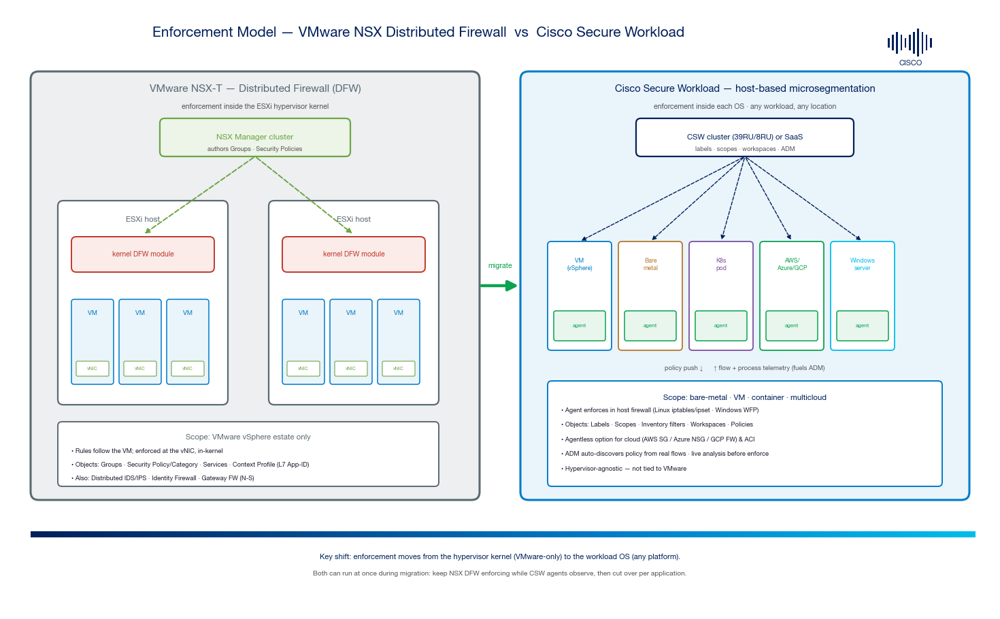
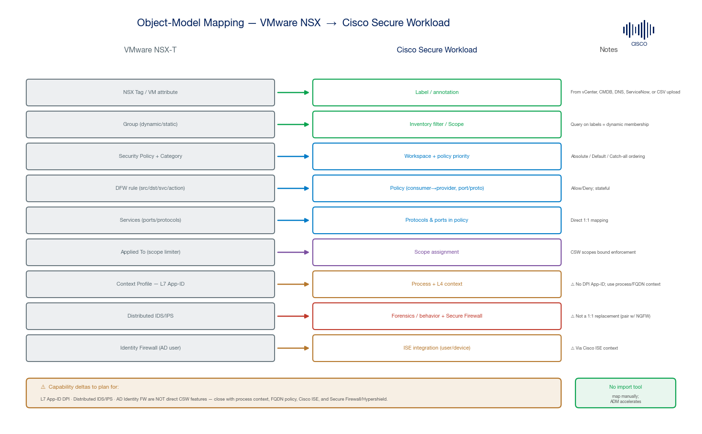
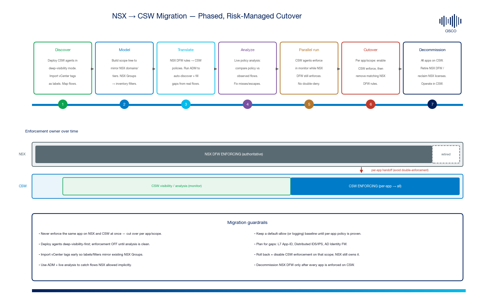

# Migrating from VMware NSX to Cisco Secure Workload — Microsegmentation Migration Guide

*A practitioner's guide to moving east-west microsegmentation from **VMware NSX-T Distributed Firewall (DFW)** to **Cisco Secure Workload (CSW)** — how the models differ, how NSX objects map to CSW, and a phased, risk-managed cutover that keeps you protected the whole way.*

> **⚠ Disclaimer:** Community field guide prepared by Cisco Solutions Engineering from public Cisco and VMware documentation — **not** an official Cisco or VMware product document, and not a competitive teardown. Confirm behaviors and capacities against the [official guides](#14-official-references) for the exact releases you run. Product names and trademarks belong to their respective owners.

---

## 1. Why customers are migrating

Since Broadcom's acquisition of VMware, many organizations are re-evaluating **NSX** for east-west segmentation — driven by **licensing/packaging changes**, **cost**, and a desire for **segmentation that isn't tied to the hypervisor**. Cisco Secure Workload is a common landing spot because it moves enforcement **into the workload OS**, so one policy model covers **bare metal, VMs, containers, and public cloud** — not just vSphere.

| Driver | What NSX does today | What CSW offers |
|---|---|---|
| **Platform lock-in** | Enforcement in the ESXi kernel — VMware only | Host-agent + agentless — any OS, any cloud, K8s, bare metal |
| **Licensing / cost** | Re-packaged under VMware Cloud Foundation | Standalone segmentation product (SaaS or on-prem appliance) |
| **Visibility depth** | Flow + some L7 context at the vNIC | Flow **and process** telemetry per host; feeds auto-discovery |
| **Policy discovery** | Manual rule authoring; monitoring | **ADM** auto-discovers policy from real observed flows |
| **Multicloud** | vSphere-centric | Consistent policy across AWS/Azure/GCP + on-prem |

> This guide is vendor-neutral in tone. The goal is a **clean, low-risk migration** — not a bake-off.

---

## 2. The core architectural shift

*Figure 1 — NSX enforces in the ESXi hypervisor kernel (VMware-only); CSW enforces inside each workload OS via a software agent (any platform). Both can run simultaneously during migration.*

| | **VMware NSX-T DFW** | **Cisco Secure Workload** |
|---|---|---|
| **Enforcement point** | ESXi **kernel** module at the **vNIC** | **Software agent** in the guest OS (Linux `iptables`/`ipset`, Windows **WFP**) |
| **Control plane** | NSX Manager cluster | CSW cluster (39RU/8RU) **or** SaaS |
| **Coverage** | vSphere VMs | VM, **bare metal**, **container/K8s**, **AWS/Azure/GCP** (agent or agentless) |
| **Grouping** | Groups (tags, name, segment) | Labels + **inventory filters** + **scopes** |
| **Discovery** | Manual + flow monitoring | **ADM** (Application Dependency Mapping) from live flow+process data |
| **L7** | Context Profiles (App-ID DPI, FQDN) | Process context + FQDN-based policy (no App-ID DPI) |
| **Threat** | Distributed IDS/IPS | Forensics/behavior + Cisco Secure Firewall / Hypershield |

**The one-sentence summary:** *enforcement moves from the hypervisor kernel (VMware-only) to the workload OS (any platform)* — which is exactly what makes CSW portable, and also what you must plan around (an agent must be installed on each workload).

---

## 3. Object-model mapping

*Figure 2 — How each NSX construct maps to CSW, with the three capability deltas called out.*

| VMware NSX-T | Cisco Secure Workload | Notes |
|---|---|---|
| **NSX Tag** / VM attribute | **Label / annotation** | Sourced from vCenter, CMDB, DNS, ServiceNow, or CSV upload |
| **Group** (dynamic/static) | **Inventory filter** / **Scope** | A query on labels = dynamic membership (same idea as NSX tag criteria) |
| **Security Policy + Category** | **Workspace** + **policy priority** | CSW ordering: **Absolute → Default → Catch-all**; categories → priorities |
| **DFW rule** (src/dst/service/action) | **Policy** (consumer → provider, port/proto, allow/deny) | Stateful; direction expressed as consumer/provider |
| **Services** (ports/protocols) | **Protocols & ports** in a policy | Near 1:1 |
| **Applied To** (scope limiter) | **Scope** assignment | CSW scopes bound where a policy applies |
| **Context Profile — L7 App-ID** | **Process context** + L4 (+ FQDN policy) | ⚠ **No DPI App-ID** — see §4 |
| **Distributed IDS/IPS** | Forensics/behavior + **Secure Firewall / Hypershield** | ⚠ **Not a 1:1 replacement** — see §4 |
| **Identity Firewall** (AD user) | **Cisco ISE** integration (user/device context) | ⚠ Requires ISE — see §4 |
| **Gateway Firewall** (N-S) | Out of CSW scope | Handle N-S with NGFW (Secure Firewall) |

> **There is no automated NSX→CSW rule importer.** You map objects deliberately — but **ADM dramatically accelerates** it by proposing policy from the flows you actually see, so you are not hand-copying thousands of DFW rules blind.

---

## 4. Capability deltas you must plan for

Be honest with the customer about these three up front — they are the usual "gotchas":

| NSX capability | Gap in CSW | Recommended approach |
|---|---|---|
| **L7 App-ID (Context Profiles)** — allow/deny by application signature regardless of port | CSW enforces **L3/L4 + process** context, not DPI App-ID | Use **process-based** policy (which binary is talking) + **FQDN-based** policy; put true L7/app-control at **Secure Firewall / Hypershield** |
| **Distributed IDS/IPS** | CSW is not an IDS/IPS | Keep threat inspection on **Cisco Secure Firewall** (or Hypershield); CSW adds **forensics, behavior deviation, vulnerability** context |
| **Identity Firewall** (AD-user-based rules) | CSW segments by workload identity, not AD user | Integrate **Cisco ISE** for user/device context where user-based rules are required |

Everything else — dynamic grouping, tag-driven membership, stateful E-W allow/deny, per-app segmentation — maps cleanly.

---

## 5. The migration at a glance

*Figure 3 — Seven phases with a coexistence lane: NSX stays authoritative while CSW observes, then enforcement hands off per application. The two never enforce the same app at once.*

**Golden rule:** *Never enforce the same application on both NSX and CSW simultaneously.* Migrate **per application/scope** so rollback is always "disable CSW enforcement on that scope — NSX still owns it."

---

## 6. Phase 1 — Discover (visibility first)

1. **Deploy CSW agents in deep-visibility mode** (enforcement **OFF**) on the in-scope workloads (Linux/Windows). Agents run **alongside** NSX — no conflict, because they are not yet enforcing.
2. **Integrate vCenter** so VM attributes/tags flow into CSW as **labels** (see the companion [CSW vCenter Integration guide](https://github.com/chandrapati/csw-vcenter-integration)).
3. Let CSW collect **flow + process telemetry** for a representative period (cover business cycles, batch windows, month-end, etc.).
4. Confirm coverage: every workload that NSX protects should have a reporting agent (or an agentless/connector path for cloud).

**Exit criteria:** agents healthy, flows observed for all in-scope apps, vCenter labels populated.

---

## 7. Phase 2 — Model (labels, scopes, filters)

1. **Recreate your NSX Grouping as CSW labels + filters.** NSX tags → labels; NSX dynamic Group criteria → **inventory filter** queries.
2. **Design the scope tree** to mirror the NSX structure customers already reason about — e.g. `Environment (Prod/Dev) → Application → Tier (Web/App/DB)`.
3. Prefer **label-driven (dynamic) membership** over static IP lists so new/rehosted workloads inherit policy automatically (the NSX tag-based advantage carries over).
4. Establish a **label taxonomy / naming convention** and, ideally, source of truth (CMDB/ServiceNow) so labels stay authoritative.

**Exit criteria:** scope tree approved; filters reproduce NSX group membership; label hygiene agreed.

---

## 8. Phase 3 — Translate (rules → policies + ADM)

1. **Run ADM** (Application Dependency Mapping) per scope to auto-discover policies from the real flows captured in Phase 1.
2. **Reconcile ADM output against the existing NSX DFW rule base** — where NSX already has an explicit intent, encode it; where ADM found flows NSX allowed implicitly (broad rules / any-any), decide intent explicitly.
3. Translate rules field-by-field:
   - NSX **source/destination Groups** → CSW **consumer/provider filters**
   - NSX **Services** → CSW **protocols/ports**
   - NSX **action** → CSW **allow/deny**
   - NSX **category/order** → CSW **Absolute / Default / Catch-all** priority
4. Keep a **default/catch-all** posture that is permissive-with-logging until per-app policy is proven (avoid a premature default-deny).

**Exit criteria:** each in-scope app has a CSW workspace with drafted policy; NSX rule intent accounted for.

---

## 9. Phase 4 — Analyze (prove it before enforcing)

1. Turn on **live policy analysis** in the workspace: CSW compares your **draft policy vs. observed live flows** without enforcing.
2. Hunt for **escaped/missed flows** (would be dropped) and **over-permissive** rules (allowed but never used).
3. Iterate until analysis is **clean** for a full business cycle — this is the safety net that catches what a straight rule copy would miss.

**Exit criteria:** analysis shows no unexpected drops for the app across a representative window.

---

## 10. Phase 5 — Parallel run (coexistence)

- **NSX DFW remains authoritative** (still enforcing). **CSW stays in monitor/analysis.**
- This is the safe steady state before cutover — both platforms are present, only **one enforces** any given app.
- Validate agent health, policy correctness, and operational runbooks (change process, exceptions, alerting) while risk is still zero.

**Exit criteria:** organization comfortable that CSW policy for the app matches reality; cutover window scheduled.

---

## 11. Phase 6 — Cutover (per application)

For **each application/scope**, in a controlled window:

1. **Enable enforcement** on the CSW workspace (agent now programs the host firewall).
2. **Immediately remove/disable the matching NSX DFW rules** for that app so the two don't double-enforce.
3. **Validate**: application health, expected allows, expected denies, no collateral drops.
4. **Rollback path** (if needed): disable CSW enforcement on that scope → NSX rules (if not yet removed) or a permissive baseline resumes control.

> **Sequencing tip:** start with a **low-risk, well-understood app** to build confidence and validate the runbook, then expand to tiered/critical apps.

**Exit criteria:** app fully enforced by CSW; corresponding NSX rules retired; monitoring green.

---

## 12. Phase 7 — Decommission

1. Once **all** applications are enforced on CSW and stable, retire the **NSX DFW** rule base.
2. **Reclaim NSX licensing** per your VMware/Broadcom agreement.
3. Keep NSX only for what CSW intentionally does not do (e.g. N-S **Gateway Firewall**, or overlay networking if still needed) — or replace those with the appropriate Cisco products.
4. Operate segmentation lifecycle in CSW (policy changes via ADM + analysis, forensics, compliance).

---

## 13. Pre-migration checklist & cheat sheets

- **Object mapping cheat sheet:** [`docs/NSX-to-CSW-MAPPING-CHEATSHEET.md`](docs/NSX-to-CSW-MAPPING-CHEATSHEET.md)
- **Planning checklist** (hand to the customer's VMware / security / app teams): [`docs/MIGRATION-PLANNING-CHECKLIST.md`](docs/MIGRATION-PLANNING-CHECKLIST.md)

### Common pitfalls

| Pitfall | Consequence | Avoid by |
|---|---|---|
| Enforcing the same app on NSX **and** CSW | Double-deny / broken app or false confidence | Cut over **per app**; remove NSX rules at cutover |
| Turning on enforcement before analysis is clean | Outages from missed flows | Deep-visibility first; analyze a full cycle |
| Copying NSX rules 1:1 without ADM | Carries over broad/any-any rules; misses drift | Use ADM to discover real intent |
| Static IP-based membership | Brittle; new VMs unprotected | Label-driven **dynamic** filters |
| Assuming CSW replaces IDS/IPS or App-ID | Security gap | Plan Secure Firewall/Hypershield + ISE for the deltas |
| Poor label hygiene | Wrong policy membership | CMDB/vCenter source of truth + naming convention |
| Premature default-deny | Broad outage | Permissive-with-logging baseline until proven |

---

## 14. Official references

- [Cisco Secure Workload — Zero Trust Microsegmentation (agent & agentless)](https://www.cisco.com/c/en/us/td/docs/security/workload_security/secure_workload/use-case/m-zero_trust_microsegmentation.html)
- [Cisco Secure Workload — Set Up Microsegmentation for Bare Metal / VMs](https://www.cisco.com/c/en/us/td/docs/security/workload_security/secure_workload/user-guide/4_0/cisco-secure-workload-user-guide-on-prem-v40/deploy-software-agents.html)
- [Cisco Secure Workload — Deploy Software Agents & Enforcement (WFP/iptables)](https://www.cisco.com/c/en/us/td/docs/security/workload_security/secure_workload/user-guide/4_0/cisco-secure-workload-user-guide-on-prem-v40/deploy-software-agents.html)
- [Cisco Secure Workload product page](https://www.cisco.com/site/us/en/products/security/secure-workload/index.html)
- [VMware NSX — Distributed Firewall / Security Policy (Broadcom TechDocs)](https://techdocs.broadcom.com/us/en/vmware-cis/nsx/vmware-nsx/4-0/administration-guide/security/distributed-firewall/configuring-your-policy.html)
- Companion guides: [CSW vCenter Integration](https://github.com/chandrapati/csw-vcenter-integration) · [CSW Policy Lifecycle](https://github.com/chandrapati/CSW-Policy-Lifecycle) · [CSW Agent Installation](https://github.com/chandrapati/CSW-Agent-Installation-Guide)

---

*Maintained by Cisco Solutions Engineering. Summarized from public Cisco & VMware documentation for planning use; example values only. Not an official product document. Trademarks belong to their respective owners.*
